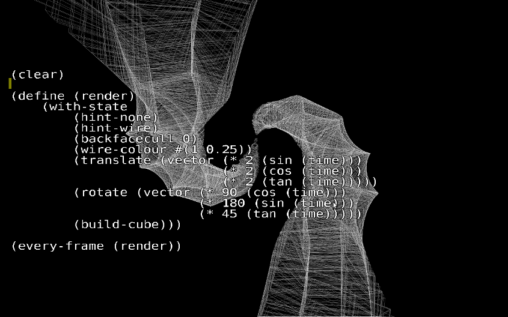
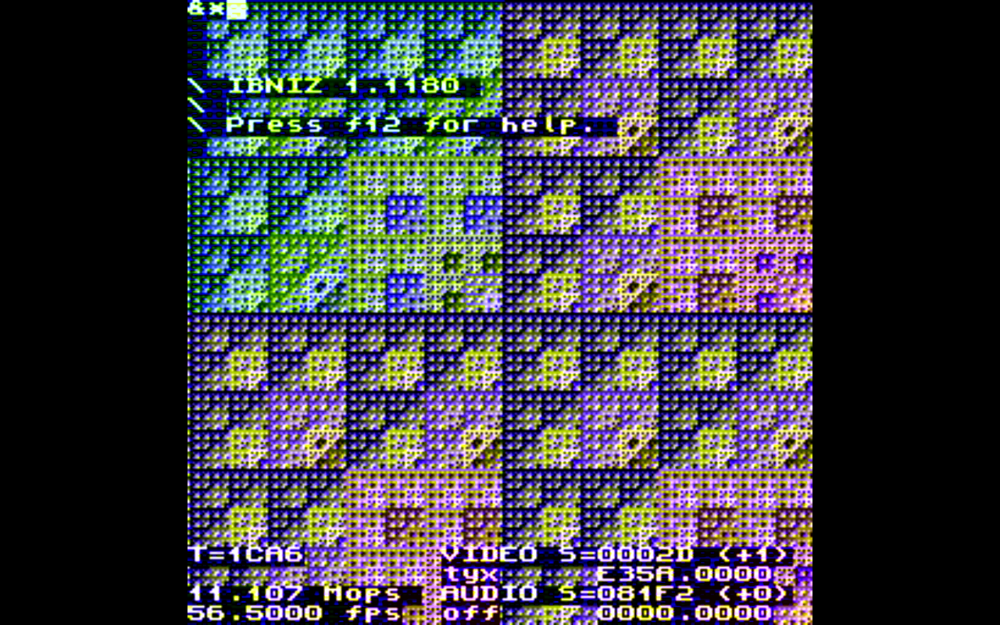
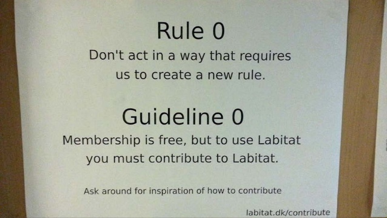

# Anti-Modern Techno-Science: Cybernetics, Ontology, Practice in the European Hacker Tradition
## Maxigas <maxigas@anargeek.net>
### Draft 1 (2015-12-14)

# Introduction: The case for deep hacker studies

Hacker artefacts, knowledges, practices and scenes constitute an alternative engineering culture that can be characterised as anti-modern techno-science.  Stemming from a break in the 1960s cultural shock [@Wallerstein2004a], hackers’ relationship to technology rests on an approach related to the cybernetic ontology identified by @Pickering2010a and articulated in the sciences by cyberneticians.  It privileges practice over representation, performance over cognition and adaptive encounters with the unknown over the domination of Nature.  In short, it is informed and forged by an experience in the ontology of becoming.

While it has been demonstrated that even engineers and scientists working in the heart of modern institutions grapple with the mangle of practice in their daily routines [@Pickering1995a], it has also been pointed out that neither official accounts of engineering or scientific work, nor the institutions that frame them are necessarily constructed according to such realisations.  Simply put, the role of material agency in techno-scientific research is not taken into account adequately by the institutional frameworks that shape practice as much as ontology does.  @Pickering2010a brought a historiography of scientists (the cyberneticians) who attempted to reformulate scientific tools, theories, practices and institutions to match their experiences in the ontology of becoming.  Starting from the figurations of cybernetics in European experiences of hacking, I argue here that anti-modern techno-science can be shown to be at work in our contemporary historical horizon.  Once again, rather than claiming that hackers work with an ontologically different technology than mainstream engineers, what I seek to demonstrate is that *ontology matters* as part of culture.

Doing so I follow the classic SCOT [^SCOT] approach as far as I assume a methodological relativism which is not concerned with the ontology of technology per se [@Bijker2009a].  Rather, it is concerned with the technological frames that different social groups construct.  At the same time, I seek to extend the SCOT approach by making the social consequences of the ontological experience lived by a particular social group the centre of the investigation.  In other words, the ontological views, conceptions and experiences of practitioners guide how they construct technological frames.  Studying hackers offers lessons on how artefacts, knowledges, practices and even organisations can be different when the mangle of practice is taken into account in a more consistent and coherent manner.

<!-- A collective exploration of the nonmodern selfhood. → *New kinds of -->
<!-- people* emerge, beyond the modern self. -->

<!-- articulated [practices] -->

<!-- ontological theatres and strange performances -->

<!-- @Latour -->

<!-- @Bijker2009a  -->

<!-- Ontological assumption in the everyday  -->

<!-- A point of caution [limitations] -->

As Pickering when researching English cyberneticians, I am more interested in how to live and how to engineer in a different way than to capture the essence or the statistical veracity of hackerdom.  The wealth of the empirical material is drawn from the European hacker tradition, but I do not claim that it captures the mainstream of hacking on the continent.^[Or even that it is restricted to the continent – indeed, some of the empirical material below takes the reader overseas, thanks to the interconnected circuits of hacker culture.]  I would rather like to chart an undercurrent of motifs that is theoretically revealing.  Everything that is laid down here is taken from my decade long anthropological and historical research into hackerspaces, but this time the ambition is not ethnological documentation.  On the contrary, it is to explore the relationship between philosophical-ontological attitudes formed between people and their machines and their role in shaping practice.^[For the same reason, I make use of no direct quotes, but simply recount pieces of hacker folklore on which a shared sense of identity rest.]  In more general terms: what happens when engineers think about the world in a different way?

# Figurations of cybernetics in the European hacker tradition

@Ross1990a identifies a shift in the expression of countercultural dissent in the decades following the 1960s.  He uses the turns of phrase *technology of folklore* to describe the ecologically-inspired anti-technology attitude of hippies with the *folklore of technology* about perseverance in a dystopian and oppressive world  through technological expertise, adopted by hackers.  He does acknowledge that it is harder to read such new dissent politically.  Developing these doubts, @Markoff2005a and @Turner2006a focuses on the cross-breeding of nascent cyberculture and Silicon Valley entrepreneurship – what @BarbrookCameron1995a called the *Californian ideology* or what @Curtis2011a blames directly on cybernetics.

Reactionary or not, as @Leary1994a vividly expresses, the translation happened through novel artefacts, knowledges and practices of the brain, which in pop culture meant mainly psychedelics.  Essentially, subjects become hollow objects to be crudely manipulated in a determinist fashion, while objects expressed a richer subjectivity in their non-determinism.  *Cyberpunk* – first as a sub-genre of science fiction and soon as a fully fledged subcultural phenomena – expressed such ontological ambiguity in the language of the gothic uncanny.  Despite the dystopian bent of cyberpunk imaginaries, hackers drew the conclusion that in case the underdogs can grasp new technologies faster than the powers that be, they can at least go out with a bang  [^Accelerationism].

As the “cyber-” prefix suggests, these advances were partly inspired by cybernetics, a transdisciplinary development in the sciences that was also organised around the ontological ambiguity of the brain as the instrumental locus of subjectivity.  Classic cybernetics was expressed in books such as *The Computer and the Brain* [@vonNeumann1958a] or *The Brain of the Firm* [@Beer1972a], and analysed in books such as the aforementioned *The Cybernetic Brain* [@Pickering2010a] or *The Mechanization of the Mind* [@Dupuy2000a].  These theories gave a good basis for technological determinist arguments (“solutionism”): e.g. that social problems can be transformed to and eventually solved as technological problems.  In other words, that revolution can be engineered.  Most commentators such as @Tiqqun2012a or @Dammbeck2003a draw dire conclusions from such way thinking, arguing that it became an overarching ideology that justified a more oppressive and exploitative society.  Such analysis is both profoundly true and necessary to address political problems of our times.  However, it takes for granted that there is a single unified essence of cybernetics, and all the originality of the cybernetic world view have been absorbed into the capitalist system.

On the other hand, Pickering singlehandedly advanced a more positive outlook based on an alternative reading of British cybernetics, picturing it as an antidote to modernity’s blind paths.  I suggest that the two – symmetric and asymmetric cybernetics [@Pickering2013a] – share an experience of subjectivity which is first and foremost an encounter with objectivity: human intentionality with the material unknown.  Their paths bifurcate in the moment of an ethical decision about how to handle the encounter.  To rephrase Ross Ashby’s remark on Clausewitz: “Who will adapt to who?” [@Pickering2010a 140].  Engineering in general and computer science in particular serve as fertile grounds for experimenting with the ethics and epistemology of such an encounter, in light of its ontological implications.

The ambiguity of cybernetics and its close connection to computerised subcultures is aptly described by Christopher Kelty in an introduction to a special issue of Anthropological Quarterly on the topic:

> The “cybernetic-informatic consciousness” that he uses to link
> journalists and anthropologists together opens a door to understanding why
> computers and cultures are equally everywhere today – and maybe for some
> surprising reasons that have a lot to do with the mid-century successes of
> both cybernetics and anthropology. Cybernetics’ fortunes look a lot like
> culture’s – overused, diffuse, heavily critiqued, yet nonetheless compelling
> in their most rigorous forms. Cybernetics’ dissemination looks a lot like
> culture’s – taken up across nearly every discipline, attenuated by
> circulation, unpoliced by classic disciplinary modes of ownership and
> exclusion. [@Kelty2010b]

Indeed, there is consensus between scholars that cybernetics started as a scientific paradigm, but quickly disseminated into other spheres such as psychiatric practice [@Pickering2010a], the arts [@Reichardt1968a; @MacGregor2002a] and its own subsequent branches such as chaos theory.  Perhaps more than other cultural movements, the European hacker tradition incorporated motifs of cybernetics in its fabric, with a special emphasis on *chaos theory*.  The latter became a sort of rallying cry for an engineering subculture that – especially in Europe – grew up on the fringes.  Since  autonomist struggles ran out of steam in the 1970s, the advent of chaos theory was in a way the only and last hope for revolutionary change.  If a very small but incredibly smart move can produce systemic change, then a hacker with a computer can save the world.  Another – less radical – interpretation simply invested its faith in the instability of systems where small changes can propel into phase changes pretty quickly.  The latter interpretation put the existing “system” in perspective and allowed for revolution by accident.  What is essential, however, is that both interpretations empowered individual actors^[Whether single individuals or small groups.] with much more freedom than what contemporary political ideologies (activist or not) or current systems theory (scientific or not) allowed.  In the era branded as the *Information Age* [@Kline2015a] ruled by Shannon’s statistical approach to communication, *noise* become the rallying cry of outsiders – and negative feedback [^negative] the analogue to the revolutionary process [@Yuill2008a].  In a chaotic world, therefore, *adaptation* was the key for survival, resiliency and perseverance.

No other person represented such tendencies better than Wau Holland.  He was as much a public intellectual as a public engineer, as much an educator as a developer.  Underpinning his ideology about universal access to computers and networks, as well as the protection of private information and the free flow of public knowledge, were devices and practices as much as discourses.  He founded the Chaos Computer Club to advance these causes and legitimise hacker practices.  In an incident that is now part of “German computer science folklore” [@WP:BTX] members wired 134,000 DMs to themselves and presented the pile of money to the press after the German postal service (which held a monopoly on home banking) refused to fix the security issues they reported in its BTX system.  They saw the broken implementation of encryption for online banking as a social problem, but authorities did not heed their advice.  Therefore, they had to *demonstrate* the problem in the long tradition of the “public experiment”: creating an ontological theatre which not only represented or described, but actually *performed* the vulnerability of informatic systems.  As I argue later on, such formational experiences cemented hackers’ trust in practice and performance over theory and representation.  Soon, chaos theory figured in the name of what is now the largest and most influential hacker organisation on the continent:

> The Club was so named not because it set out to cause chaos but rather
> because one of the founders, Wau Holland, felt chaos theory offered the
> best explanation for how the world actually worked.  Dutch hacker and
> entrepreneur Rop Gonggrijp says the club is about “adapting to a world
> which is (and always has been) much more chaotic and non-deterministic than
> is often believed”. @Brooke2011a

With the establishment of the Chaos Communication Club in 1982, chaos theory came to be embraced in the hacker scene as an explanation of *how the world actually worked* – in other words, an ontology, and one hinged on performance.  Following the establishment of regular hacker meetings such as the yearly Chaos Communication Congress (now in its 32nd edition), the foundation of shared machine shops ushered in a subsequent period of hacking.  These served as club houses for the hackers who – legitimised by their official organisations and high-profile actions in the public interest – now organised publicly.  One of the first was c-base in 1995, continuing the ***c***ybernetics, “***c***yberpunk”, ***c***omputer associations.  However, the mainstream success of hackerspaces started with Metalab in Vienna, which was initially proposed as KyBase (“Cybernetic Base”) in 2005. [^Metalab] This was not an accident because the hacker club behind the idea was called Wiener Kybernetischer Kreis: a word play on the name of cybernetics founder Norbert Wiener, the name of the city (“Wien”), and the interdisciplinary Vienna Circle (“Wiener Kreis”) that played a decisive role in the intellectual trajectory of the twentieth century [@WP:Metalab].  However, hackers decided that references to cybernetics were too obscure to draw a more diverse audience, and called their base Metalab instead.  Indeed, Metalab then provided the blueprint and inspiration for many subsequent hackerspaces [@BreAstera2008a].

Hackerspace Brussels (HSBXL) materialised in 2008 while hackerspaces were exploding in numbers.  Its identity also plays on Norbert Wiener [@HSBXL:Metalab] who is pictured in the logo wearing flicker glasses.  Flicker glasses are basically sunglasses equipped with flashing LED lights on the inside, treating the wearer to distinct visual effects.  As Pickering acknowledges (419), they are descendants of British cybernetic artist and inventor Brion Gysin’s Dreamachine, which was a turning tube with holes along its surface producing a similar effect thanks to internal illumination.  British cybernetician Grey Walter’s book *The Living Brain* inspired the invention, which was built in collaboration with Ian Sommerville, a computer programmer and companion of Burroughs and other Beats.  Walter was the first to describe the psychological effects of flicker [“The Central Effects of Rhythmic Sensory Stimulation”; @Walter1949a].  Later he commented on the commercial success of stroboscopes in discos to the effect that he should be paid a royalty [@Pickering2010a 78-83].  However, much like other cybernetic motifs, flicker arrived to European hackers through American mediation.  It was the San Francisco-based Mitch Altman who popularised remakes of the device in hacker circles [@Cornfield2013a].  He soon acquired a significance comparable to Wau Holland in the hackerspaces scene, spending much of the year travelling from hackerspace to hackerspace, teaching people to solder and work with electronics while spreading a DIY [^DIY] anti-military message.  The emblem of his teachings was the Tripglass, which participants could make at soldering workshops. [^Tripglass]

Closer to where this volume has been conceived and prepared – in the hackerspace of München called μC3 [^CCCM] – members prepared an electronic name tag for the 2011 Chaos Communication Camp in the summer.  The event is organised every four years since 1999 as the biggest and most significant outdoor meeting of hackers on the continent.  American hacker conferences already featured electronic name tags, but the idea of German hackers was to make an artefact that can be actually useful after the meeting.  I analysed in my doctoral dissertation [@Maxigas2015p] how team r0ket sought to gather everything that is significant about hacker culture into a single object that would be given to all participants at the gathering, creating a sort of encyclopedia of the scene.  The artefact thus became a small computer with a screen, joystick and peer-to-peer wireless features: an open hardware analogue of the mobile phone.  It was still a major attraction at the annual Chaos Communication Congress at the end of the year in Berlin, where the group experimented with its wireless tracking capabilities.  In order to demonstrate the socio-technical potential of the artefact, its makers decided to devote the second part of their r0ket presentation to another public experiment.

The experiment replicated a scene from Adam Curtis’ documentary series on cybernetics: *All Watched Over by Machines of Loving Grace*.  The films were released that spring while the r0ket was in production and inspired team members.  In the opening sequence of the second part, entrepreneurs Loren Carpenter and Rachel Carpenter [^Carpenters] retell an experiment they made while archive footage of the occasion is shown in cutaways.  Participants in a cinema setup were seated in front of a huge screen and given rackets without explanation.  The rackets were green on one side and red on the other – as in ping-pong.  The popular arcade game Pong appeared on the central screen.  Participants worked out that they could control the paddles.  People on the right rows controlled the right paddle, people on the left rows the left paddle.  If enough people on a particular side showed up red rackets, the corresponding paddle moved upwards.  In order to reach the top of the screen,  everybody on that side had to show a red paddle: there had to be a consensus.

The original organisers and the filmmaker agreed that the experiment demonstrated real-time, spontaneous, emergent social order taking advantage of coordination between a large number of participants using Information and Communication Technologies.  The key observation was that social order can be established without deliberation between peers and mediation through institutions: it is enough if participants have statistical information about the free choices of others.  Free cooperation could work at scale, provided that it is mediated enough technologically.  Curtis interprets the experiment as an ideological justification for a technologically enhanced free market as the medium of social peace.  The Californian ideology proceeded on this course. 

<!-- FIXME: explain the difference between the classic and the repeated experiment.  -->

Of course the use of cybernetic imagery in hacker culture is not internally coherent, even if it’s presence is consistent.  For instance, where hackers champion chaos, their idol Norbert Wiener may champion order.  At least according to Klein, Wiener appeared to the average American as a humanist enemy of chaos:

> In his masterwork, America as a Civilization (1957), journalist and
> educator Max Lerner quoted Wiener’s idea that “communication is a dialogue
> between people united against the common enemy, whether we call it entropy
> or chaos.” It was one of the few popular references to Wiener’s extensive
> discussion of entropy in his books. [@Kline2015a 96]

So far we have only dealt with figurations of cybernetics in what anthropologists and philosophers call the symbolic order: signs, names, significant objects and rituals.  The next section focuses on social practices where the cybernetic ontology can be seen in action.  However, let me conclude this section first by a quick summary.

In the 1950s and 1960s both hacking and cybernetics emerged from the socialisation and systematisation of Second World War techno-scientific advances, at a specific moment characterised by ample funds for base research at least in the United States.  Notwithstanding their origins in the academic-military-industrial complex, they were  influenced by and influencing the countercultural movements that flourished in their wake.  As both tendencies show, the relationship between science and technology drew ever more close, yet it is fair to argue that cybernetics was articulated primarily as a scientific culture, while hacking as an engineering culture.

Throughout the 1970s and 1980s cybernetics – or at least chaos theory – provided a much needed explanation of how the world actually works to hackers, who acquired an identity as a movement and a self-image as the underdogs of engineering.  Semi-underground scenes have been formed which often came into contact with larger social structures like the authorities or corporations (the state and capital, respectively).  Especially in the European context, hackers started to reflect on their socio-political roles and responsibilities as renegade engineers.

By the 1990s and 2000s, prominent personalities and organisations in the European hacker tradition were at least aware of some classic cybernetic scientific figures, artefacts and theories.  Even if the translation of cybernetics into hacker culture has been very superficial, partial and fragmented, it remains that cybernetic motifs were woven into its fabric.  This is not to suggest that the structural similarities between the ontology that informs the practices of Pickering’s cyberneticians and the world view that shapes hacker practices can be explained by a common genealogy.

<!-- Notes -->

[^Accelerationism]: These ideas are not far from current intellectual fashion of left Accelerationism.

[^Carpenters]: “Rachel Carpenter has served as CEO and Producer for Cinematrix Interactive Entertainment Systems® since the introduction of its patented audience participation technology in 1991. … Loren Carpenter, inventor of the CINEMATRIX Interactive Entertainment Systems® audience participation technology, holds multiple patents and has received numerous awards for inventing breakthrough computer imaging technologies.” @Cinematrix2002a

[^SCOT]: Social Construction Of Technology.

[^negative]: The self-amplification of noise.

[^Metalab]: Metalab was formally founded the next year (2006).

[^DIY]: Do It Yourself.

[^Tripglass]: Later the Tripglass was replaced by the TV-B-Gone universal remote control that can turn off any television.  Mitch’s latest product is the Neurodreamer, a return to Gysin’s Dreamachine.

[^CCCM]: Chaos Computer Club München.

# Practices favouring practice

Before introducing practices that are idiosyncratic to hacker scenes I would like to recount a scene that everybody can relate to.  An unspecified francophone hackerspace got flooded because the landlord repeatedly refused to fix the roof of the old factory.  Equipment was damaged and water covered a large part of the club.  A member proposed to drill a hole in the floor and sweep water down to the workshop of the landlord below.  The idea was adopted on a whim and since machine tools were stocked in the hackerspace, the hole was ready in a matter of minutes.  The hackers did not bring it up with the landlord, but he fixed the roof the next week.

What I find revealing about the incident is that members were thinking directly in material agencies and how to mobilise them, sidestepping institutions and symbolic communication between humans.  Just like in the case of the BTX, it was not enough to report vulnerabilities in the infrastructure: hackers had to demonstrate them with a performance.  Instead of talking, then, the hackers had to do something to get their point across.  Moreover, instead of mopping up the water, they accommodated its challenge by letting it continue its flow through the space.  In the course of the exercise, they entered a risky situation that could have gone in different unexpected ways, and they were ready to accept the consequences.  The most striking aspect for me, observing the scene, was how little discussion and hesitation went into it.  It was clear that I was immersed in a culture that favours practice over representation, and performance over cognition, ready to go where material agency takes the engineer.

The next passages map engineering practices that privilege practice, rounding off with one that hints at how different organisations can be built when the primacy of practice is taken into account.

* * *

**Live coding** is programming as performance.  Live coding environments typically produce visuals to be projected onto a screen in front of an audience, sometimes accompanied by audio output from the same source.  Technically, they are source code editors which recompile the code after every statement typed, and display the results in the background.  Thus, the coder builds up the program in front of the audience, similarly to jazz improvisation.  As in music, collaborations and jam sessions are common and systems allow the interconnection of inputs and outputs from various sources.  The source code is overlaid on the animation so that spectators can follow the evolution of the graphics and the underlying program simultaneously.

I would like to highlight three practical consequences of such an arrangement.  First, all errors, mistakes and crashes are shared with the audience.  In fact it is a commonplace amongst programmers to accept that the first version of a piece of code never runs adequately, so that it requires tuning to get it right.  However, popular discourse pictures programmers as powerful wizards who create algorithms ex nihilo.  Live coding demystifies programming by showcasing the process and not the product, and exposes the vulnerability of the programmer.  Simultaneously, it also demystifies software itself, which is shown to include plenty of glitches.

Second, the practice is obviously a critique of black boxes and a performance of the FLOSS (Free and Open Source Software) paradigm.  FLOSS advocates cite many reasons why it is beneficial if the source code of an application is available for everybody to review, run, develop and distribute.  FLOSS practices are primarily enforced by legal instruments such as licences.  Live coding makes FLOSS values explicit and inevitable through the architecture of the live coding session, where it is impossible to develop and distribute the code separately.  Therefore, representation and performance are so tightly coupled that typing instructions is less seen as encoding a symbolic representation and more seen as a performative act in itself, much like in computer games. [^Programming] A corollary is that code, along with its rhythm and other manners of inscription becomes aestheticised: writing appears as an act in itself regardless of its cognitive meaning or compiled results.

Third, programming under such constraints is less considerate than in a normal office environment.  Live programming language constructs are often syntactically terse to the point where their human understanding is barely possible.  Moreover, the real time performance of programming means that there is no time to pause and ponder.  Therefore, once again, the programmer is not in a position to simply bend the forces of Nature to her will, but generally has to adapt and often yield to the material agency of code.  In the same way as programming can be considered a critique of the poor performative properties of human language, live coding can be considered a critique of the poor performative properties of mainstream programming techniques.  My personal experiments with the Ibniz live coding environment pointed me in this direction.  In Ibniz every conventional language construct (addition, multiplication, else, if, bitwise or, etc.) is represented by one character, and the program is compiled roughly sixty times a second, giving the illusion of continuous motion as in cinema.  When presented with the device, programmers quickly become frustrated because even after reading the manual, it is hard for them to foresee, predict, and therefore control the effects of a program.  Laypersons, however, are gleefully typing on the keyboard while exploring the combinations and intensities encountered.  What they type is not structured according to the likeness of conventional software code, it is neither random nor simply written in a human language.  They keep and add characters that seem to have interesting effects, and try out new ones without having any idea what to expect.  Therefore, the activity is historically emergent and dependent on the dialectic between human and material agency.

However, these aspects can be drawn together into a single thread by looking at them as different ways to expose professional live coders, their audience, or lay programmers to the unknown.  It is not simply that none of these people have much of an idea what comes out of a live coding session.  What is striking about such a practice is that it is explicitly geared towards encounters with the unknown.  In the language of *The Question Concerning Technology* one may say that live coding is a technological practice of revealing rather than enframing [@Heidegger1993a].  The point of the dialectic of resistance and accommodation in their temporal emergence is not to achieve a specific intended consequence but rather to play with the dialectic itself.  I will argue later that such an approach can be seen as an ontologically grounded ethical relationship with machines.  Here I would rather emphasise that live coding does not simply engender such a playful relationship with material agency, but as a veritable ontological theatre, it also showcases it to the observers.

Figures 1 to 4 show screen captures from live coding environments.

[^Programming]: Programming practices used for developing robust industrial applications are in perfect contrast with live coding environments. Programming languages used in such situations (such as C, Java or Go) are *compiled*, which means that there has to be an explicit step where the source code is turned into executable code.  Most programming today is done in *interpreted* languages where the source code can be executed without any transformation.  Live coding takes this to the extreme by executing the source code continually, every fraction of a second.

* * *

According to University of Washington researcher Keunwoo Lee, **exploratory programming** is about “programming by ’trying stuff out’ and seeing what happens” [-@Lee2004a].  Therefore, it is a close relative of live coding.  It is a programming methodology taught in computer science and recommended for tackling problems that are not well understood.  For the same reason, it is ideal for learning by doing.  Since hackerspace members are not required to produce anything in particular, but often eager to learn, it is not surprising that exploratory programming is popular amongst them.  Exploratory programming is most interesting when it is used to understand a particular property of the programming language itself, or even when it is loosely concentrated on a problem domain, rather than a particular real-world problem.  The methodology and its technical repertoire is designed to iterate over possible solutions and hopefully find new ones through the process.  Therefore, exploratory programming is a methodology to engage with the temporal emergence of material agency in order to find a way to approach a problem that was not obvious before.  It allows the programmer to answer to the unknown arising during programming by changing the entire orientation of the work, to the point where even the target problem can be changed.

In the hackerspace of Budapest (the Hungarian Autonomous Center for Knowledge, alias H.A.C.K.) one Autumn afternoon I sat with several members around the table.  One of the best programmers of the space announced happily that he is ready with paid company work, so now it is time to start another project.  After a few hours of intense work I asked him what is the new program about – what is it doing.  He answered that it is not possible to know yet.  I was astonished because he already wrote so much code.  It was as if he walked out in the wilderness without a destination.  He was building a kind of general system to programmatically parse web pages, but it was not clear yet what are the real world tasks for which it could be used more effectively than existing solutions.  This way of approaching a problem was very different from most average programming jobs where coders are paid to implement a pre-written specification, or at least work with a client to build a good product incrementally.

It was close to some academic work where ideas are tried out and practical applications can wait.  However, even academic researchers have to write a research proposal, get funding and conform to an institutionalised timeline, not to mention answer to bosses.  However, in this case there was no boss and no institutional framework, only the programmer and problem.  Conversely, the result would not be remunerated by anything other than the experience itself and perhaps the respect of peers.

While in most cases exploratory programming may not be so efficient as a less spontaneous software development methodology, it is surely more entertaining.  After all, it allows programmers to do what most of them enjoy the most: programming.  As the hacker saying goes: “Two hours of planning can save you two days of coding – but then again, two days of coding can save you from two hours of planning.”

* * *

**Penetration testing** is about attacking a technological system in order to find faults in it.  It can be done with malicious intent in which case it can be simply called hacking or cracking, but it can also be done under contract in order to improve security by reporting problems found in practice.  For instance, banks are required to hire security companies to make sure that they systems are secure and their infrastructure conforms to the relevant industry standards.  Many such companies are run by hackers.  Penetration testing can include anything from breaking into a computer network, through physical security like stealing paper documents from facilities or social engineering where the attacker talks their way to sensitive information.  However, all these approaches follow a similar way of working, and here we focus on computer networks because it is the most widespread area of expertise in hackerspaces. [^lock]

My claim is that in order to work on penetration testing, one first has to accept that there is a gaping field to be explored between representation and performance.  While most programmers and administrators start out by assuming that the actual performance of a program is more or less accurately described in its specification (because they have to use it as a building block in their systems), penetration testers could not even start their work without assuming that the program actually behaves differently under certain circumstances.  It is those circumstances that the penetration tester is interested in, and most often they are to be found by trying out the application in a wide variety of ways, looking at typical mistakes and known flaws in its components.  If there is a way to compromise the system, it is called a *vulnerability* [^CVE].

Vulnerabilities are effectively the (most lucrative) products of penetration testers.  Even though they are always already there in the system, hackers discover them.  While a vulnerability is a description of a weakness, eminent vulnerability reports also include *exploits*.  An exploit is a short piece of code that demonstrates the vulnerability by triggering it in practice.  Therefore, exploits can be used to compromise systems in practice even by people who have only basic informatics knowledge. [^kiddies]  Exploits are also recognised for their exchange value and consequently brought and sold on the black market, or acquired legally by vendors through bug bounty programs, or even reported on public mailing list by independent researchers.

Exploits can be conceptualised as ontological theatres which extort systems into strange performances.  “No system is secure” is a mantra of hackers and each vulnerability is an additional proof of this point.  Vulnerabilities are studied by hackers both for fun and profit.  Their entertainment value comes from the fact that they achieve some unusual, often seemingly impossible task – the most prototypical being gaining administration rights to a system without knowledge of the appropriate credentials.  The root of the vulnerability are the unintended consequences of the software written by developers or the actions of the system administrators who run the vulnerable systems.  Since the consequences are unintended, most vulnerabilities are discovered by examining the performance of the systems in practice, rather than the underlying theories, even though the vulnerability may prove the theory behind the system flawed.  Therefore, a vulnerability is often theoretically impossible, and by definition unknown before its discovery.  The penetration tester have to be open to the unknown and do things that invite it to manifest itself.  There are penetration testing methodologies which are taught in universities, but searching for vulnerabilities remains a craft that requires a calling, rather than a routine procedure than can be laid out in manuals.

An ontological theatre does not only take advantage of a particular ontological outlook in its design, but also showcases it through its performance.  As a living proof that a system does not only work as advertised, but also in other “strange” ways, an exploit points to the distance between representation and performance.  Such a performance is “strange” because it goes beyond – and very often against – the way given system is supposed to work.  As such it also showcases and legitimises the epistemological advantages of working in close consideration of the cybernetic ontology.

* * *

**Rapid prototyping** is a way to develop hardware without (detailed) plans. [^rapid] Rapid prototyping incorporates a dedicated repertoire of general purpose technologies which are geared towards fast cycles of iterative development rather than correctness of implementation or economy of resources.  Programmable microcontrollers (such as the open hardware Arduino board) and FPGAs (Field Programmable Gate Arrays) are as much part of its toolkit as electronic workshops in hackerspaces that stock basic components such as LEDs, stepper motors and breadboards.  Rapid prototyping focuses on making something that works as soon as possible [^lean]. Subsequent iterations take the artefact as a starting point, and propose changes based on the performance and potentials showed by the artefact, rather than on a pre-defined specification, road map or product sketch.

Both @Pickering2010a and @Dupuy2000a give special attention to the changing role of the experiment and models (respectively) in cybernetic research.  They argue that one result of the shifting ontological orientation of cyberneticians was a corresponding change in what counted as an experiment in scientific practice.  *Modern* experiments aim for a reproducible environment where ideally only one variable is changed at any one time – a tradition rooted in the work of the 16th century philosopher Sir Francis Bacon.  Cyberneticians, however, came to terms with a more messy experience of the world.  *In vivo* experiments happened in direct interaction with matter under real life conditions.  Therefore the meaning and content of scientific experiments came closer to the everyday usage of the word.  Interaction with what cyberneticians called *complex systems* (such as Gray Walter’s tortoises, Ross Ashby’s homeostatic setups or Stafford Beer’s pond) required researchers to make interventions in processes they could not fully model.  As @CantwellSmith2010age argues, cybernetics can be seen as an answer to the crisis of modernity, where researchers faced phenomena which was deterministic but not predictable – two properties which went hand in hand in previous research.  It is exactly this aspect of cybernetic research which was developed in its offspring, chaos theory, and which figures prominently in the hacker tradition.

Rapid prototyping – especially in hardware – is also highly dependent on the equipment that developers can get their hands on, since ordering new components or acquiring funding slows down the process.  On the one hand, hackerspaces traditionally include a junkyard of sorts that hackers scavenge for components.  On the other hand, hackerspaces are filled with unfinished projects that are waiting for developers to have more time or money to work on them, find or get shipped a missing component, or for others to take up interest in the idea.  Finally, it is also common to take apart actually finished projects and reuse scarce components or even whole subsystems.  These constraints can be interpreted as another form of material agency that plays its part in rapid prototyping and emerges both historically and stochastically.  Even if the results of British cybernetics have been distilled into (pseudo-)scientific books and articles, how the substance of the work was carried out was nothing short of tinkering with engineering in a largely peripherial setting.  Needless to note, these characteristics neatly describe the hackerspaces of today, especially as the sites of hardware hacking and rapid prototyping.

There are three notable threads that tie together the ontological theatres which lead to the initial breakthrough of UK cybernetics: Grey Walter’s tortoises, Ross Ashby’s homeostats and Gordon Pask’s Musicolour.  First, they were constructed from the junk left over after the Second World War: surplus bomb relays from the RAF and obsolete telephone relays from the Post Office.  “Elizabeth Pask (n.d.) recalled that Gordon and Harry Moore built Musicolour from ’old relays and uniselectors junked from post office telephone exchanges’ – the same components that Walter and Ashby used in their model brains” [@Pickering2010a 324]. [^relic] In fact, cybernetics itself was largely a product of synthesising theoretical and practical advancement made during the war: “out of the detritus of war and a technological society” [@Pickering2010a 324]. But what is more crucial for the present argument is that the design and implementation of these artefacts was largely influenced by the technological debris of the time that was laying around in their makeshift workshops.

On a similar note, hackerspaces are filled with the thrown away technologies of latter generations, to the point where several of them collect typewriters (used by typewriting clubs that meet regularly at the premises) and operate museums of working computers (for instance at Arnhem, The Netherlands or in Catania, Sicily).  In turn, machine tools obsoleted from factories and laboratory equipment from upgraded research centres finds its ways to hackerspaces through networks of well-wishers.  Technical solutions, design insights and salvaged components find their way into prototypes from these machines, which are often more simple and modular than contemporary models.  While for the cyberneticians working from debris was solely a necessity, hackers often attempt to make it a virtue.  Like the ontological theatres of the classic cyberneticians, a prototype often showcases an idea or an enigma, an intervention whose actual engineering could be deceptively simple.

Second, UK cyberneticians pursued cybernetics as a side project barely (if at all) tolerated by their respective institutions.  “I am struck, first, by the profound amateurism of British cybernetics. Key contributions often had an almost hobbyist character: Walter built his first tortoises at home in his spare time; so did Ashby his homeostat (at least, in the apocryphal version of the story); likewise Beer and Pask’s experimentation […]. Cybernetics welled up outside the usual channels, and it found little support within those channels” [@Pickering2010a 10]. [^kitchen]

Hackerspaces are likewise marginal institutions, with the crucial difference that they were explicitly constructed to inhabit marginality as a countercultural position.  Hackers realised that their exploits and out of the box engineering culture goes beyond the confines of modern institutions, so they banded together to pursue an alternative trajectory.  Consequently, hacking is a popular tradition which developed a relatively wide social basis by now.  As a result, hackers can often rely on their own infrastructure such as the hackerspaces on the one hand, and increasingly get what they want from institutions on the other hand, when they really need to.

<!-- “Second, as we have also seen, Pask’s first project as a cybernetician was undertaken in an undisciplined space outside any conventional institutional structure – he built the first Musicolour machine in his rooms at Cambridge, out of the detritus of war and a technological society. I mentioned bits of Calliope organs and bomb sight computers earlier; Elizabeth Pask (n.d.) recalled that Gordon and Harry Moore built Musicolour from ’old relays and uniselectors junked from post office telephone exchanges’ – the same components that Walter and Ashby used in their model brains. One could speak here of a lack of material discipline as well as social discipline. Like our other cyberneticians, then, Pask’s cybernetics bubbled up outside the normal channels of society. And along with this undisciplined aspect went the protean quality of Pask’s cybernetics: Pask was entirely free to follow his own inclinations in developing his cybernetics in a theatrical direction, a more or less unprecedented development.” [@Pickering2010a 324] -->

Third, what guided the development of these prototypes was what can be termed a trial and error approach that is tinkering’s own.  As Pickering points out, the prototypes behaved in ways unexpected even by their creators, so that their development drew on a wide range of things users learned in interaction with previous prototypes, rather than mere inductive reasoning.  Here the early cyberneticians had to substitute both engineering expertise and a good grasp of their proper subject matter (let’s call it unpredictable phenomena or the unknown) with persistence in experimentation.  Through spending time with their surprising creations they developed an intuitive – hands-on – knowledge that I would call an engineering taste.  As Pickering notes, these experiences brought strong aesthetic sensibilities to the science of cybernetics.  Similarly, many hackers would readily consider engineering an art and insist on taste as a crucial skill.  This is the ability that allows the good developer to response appropriately to the leads of material agency manifested in the jolts and quirks of  prototypes.

Bringing these three aspects together, Pickering’s summary is that “If Wiener’s cybernetics grew directly out of a military project, Walter’s was instead improvised in a material culture left over from the war.” [@Pickering2010a 56]  Technologically, European hackers have been working hard to emulate and subvert US high-technology with the materials they could get their hands on, but in terms of organisation, they could build on the fading experiences of the strong autonomous and later squatting movements.

When @Latour2008a writes about the virtues of design thinking as an amodern form of thought, he emphasises that design always starts with something which is already there.  Therefore, design is always redesign.  For Latour, this is in opposition to the Promethean hubris of modernity where the inventor is supposed to create ex nihilo.  Latour praises the careful humility of design which never starts from scratch, but shapes things attentive to the circumstances.  However, it is curious that it never occured to the author of *We Have Never Been Modern* that Prometheus actually stole the fire rather than invented it.  The fire was already there, what happened is that it was made public.  Nonetheless, Latour’s description sits well with rapid prototyping, which starts from the material available at hand, strives to create a functioning thing as soon as possible, and tinker on from there, rejecting  “’destroy it all and build something completely different’ modernism” [@Flynn2014a].

An additional factor – in hardware as well as in software – is the limited knowledge of the developers.  Hackers often venture out of their comfort zone in terms of technological specialisation, but they cannot learn everything belonging to the new domain at once.  Therefore, they bring knowledges from other fields and try to valorise them in other environments.  Two rules of thumb are relevant here: “If you have a hammer, everything looks like a nail.” and “The most suitable programming language for the problem is the one you already know the best.”  Once again, such constraints do not lead to more correct or more efficient implementations, but can expand engineering culture in unexpected ways.  It is easy to draw the parallel with the UK cyberneticians, who are as famous for their books as for their artefacts, as public intellectuals and public engineers, even though non of them earned a degree in engineering, neither held a position as such.

In hackerspaces especially, tinkering is based on personal initiative and a desire to play with technology.  This can be interpreted as a willingness to engage with material agency wherever it takes the hacker.  Arguably, the hackerspace is an organisation built for the engagement with material agency as its primary function, unlike academic institutions whose mission is also educational and corporate research departments which focus on product development.  The education, research and production in hackerspaces is a mere corollary to that – which is demonstrated in how they can mix seamlessly.  In particular, prototypes made in hackerspaces often evade modern categories of instrumentalisation.  It is not clear whether they are prototypes of personal projects, learning exercises, artworks, commercial products or activist interventions.  Hackers working on the project are often altogether uninterested in the question.  At some point the project may be abandoned, nailed to the wall of the hackerspace as an example of how to (or how *not* to) connect to specific kinds of chips to each other, but it could also become an activist intervention in a political debate or just as well provide the basis for a lucrative startup initiated by members.  These destinies matter little when the point of the process is to engage with material agencies: to encounter the unknown on a common ground.  In the same vein, Pickering writes that “[l]ike our other cyberneticians, then, Pask’s cybernetics bubbled up outside the normal channels of society. And along with this undisciplined aspect went the protean quality of Pask’s cybernetics: Pask was entirely free to follow his own inclinations in developing his cybernetics in a theatrical direction, a more or less unprecedented development.” [-@Pickering2010a 324]

* * *

As @DickelFerdinandPetschow2014a points out, however, hackerspaces are not merely technologically inventive – hackers are also conducting “real world experiments” with organisational structures and techniques.  Unsurprisingly, these also privilege practice over representation, performance over cognition, and adaptive encounters with the unknown.  While in the beginning of this section I related a concrete situation that was shaped by what I call anti-modern outlook rampart in hackerspaces, here I point to an entire organisational paradigm by way of rounding off the inventory of hacker practices.

**Do-ocracy** is the self-proclaimed organisational form of at least some hackerspaces, and a popular slogan in others.  It is inspired by renowned hacker Grace Hoppers’ famous phrase “It’s easier to ask forgiveness than it is to get permission.”  In the same spirit, members are encouraged to act on their own initiative without proposals or negotiations, drawing on the subsequent inspiration or disappointment of others to determine whether to go further on the same path.  For instance, new projects need not be announced but actually began to be implemented, which puts other members in a much better position to decide whether they want to join the effort.  In the same vein, changes to the very infrastructure of the hackerspace can be made arbitrarily, counting on reactions of the membership to see whether an actual improvement have been made.  Do-ocracy can be seen as an answer to cumbersome corporate bureaucracies on the one hand, and never-ending anarchist assemblies on the other hand.  As the Figures below suggest, it comes mixed with bigger or smaller doses of the ethics of care – depending how reflective are the given hacker community about forms of structural repression.

Of course, the legitimation of do-ocracy goes back to the social experiment explained in the Figurations section.  As Curtis notes, the ideas behind the social experiment and do-ocracy are dangerously close to how neoclassical economists imagine a free market – a vision that merely clouds the realities of actual markets where monopoly power trumps inventiveness.

<!-- The unknown has a place in such hacker practices as *exploratory programming*, *rapid prototyping*, *live coding*, *reverse engineering*, *penetration testing* and the  -->

[^lock]: Hackerspaces often host lock picking sport clubs and sometimes social engineering workshops, but computer security is more popular.

[^CVE]: Serious vulnerabilities – when publicly known and acknowledged – are assigned a CVE (Common Vulnerabilities and Exposures) number by the MITRE Corporation and appear in the US National Vulnerability Database.  The CVE system is funded by the National Cyber Security Division of the US Department of Homeland Security.  Anybody can request a CVE number by submitting a report of the vulnerability, and the reports are available to the general public.  Vulnerabilities are reviewed and vendors are notified of the vulnerabilities in their products.

[^kiddies]: Such are called *script kiddies*, because they are using script developed by other people rather than doing their own research like a real hacker.

[^rapid]: Rapid prototyping is also used in software engineering, but here we focus on its more popular use in hardware hacking.

[^lean]: This it shares with currently fashionable *lean methodologies* in software development.

[^relic]: “The only other reference I have found to Ashby’s source of parts for the homeostat is to the detritus of World War II: ’It has four ex RAF bomb control switch gear kits as its base, with four cubical aluminium boxes’ (3 March 1948, p. 2341).” [@Pickering2010a 426]

[^kitchen]: “In an obituary, his student Roger Conant (1974, 4) speaks of Ashby building the homeostat ’of old RAF parts on Mrs Ashby’s kitchen table’” [@Pickering2010a 112]  According to other reports the kitchen table is probably an exaggeration.

# From cybernetic ontologies to hacker ethics

Ethics mediates between ontology and practice.  Therefore eliciting the ethical consequences of the view of the world distilled in the cybernetic ontology can further illuminate the practices described in the previous section while preparing the ground for the political conclusions in the next section.  Departing from @Pickering2010a, I theorise the ethical consequences of the cybernetic ontology by way of the ontological ethics of Emmanuel Lévinas.

The starting point of Lévinas’ ontological ethics is a Hegelian understanding of the Other as an existential threat to the phenomenological subject.  The threat comes from the ambiguity of the Other between being another agent like me, but also fundamentally different.  The proposed ethical relationship with the Other is modelled on the conversation.  In short, the conversation allows for keeping a distance and therefore recognising difference, while at the same time exposing oneself and therefore be effected by the relationship.  The conversation does not seek to destroy or assimilate the Other, but to learn and adapt to it.  There are obvious parallels here with the Conversation Theory developed by the classic cybernetician Gordon Pask [-@Pask1976a].  Moreover, both authors conceptualised the conversation as not necessarily verbal, leaving theories open for performative interpretations.  However, in order to illuminate the ethical relation to the Other, Lévinas uses further timely metaphors such as hosting the other in my home, but also falling hostage to the Other in a foreign land.

My suggestion is that this formulation of ontological ethics is descriptive of hackers’ relationship to material agency found in their interactions with machines.  In line with the argumentation about the unstable ontological divide between subjects and objects that is expressed in cyberpunk works, the Other takes an objective form in these experiences.  While certainly a departure from Lévinas original thought, I hope that the recognition of the Other as the material agency performed by objects explains many aspects of hacker culture.

On closer examination, each of the practices above share a few characteristics that point to such a realisation.  All have to do with the recognition of material agency in the form of bugs, or glitches in computer science.  It is not hard to recognise that the resistance of the material manifests itself as a bug or glitch in the technological system.

First, the creation of situations in which bugs can occur and unfold.  Since bugs are the products of penetration testing, it is no wonder that security experts have mastered the art of summoning errors through unexpected inputs into the system.  Do-ocracy as an organisational form is also open to bugs, since it is considered essential for members to be comfortable making mistakes.  Second, accommodation but not recuperation of bugs into the development process.  Thanks to the real time nature of live coding, bugs necessarily become part of the performance, so that live coders have to recover from computer crashes or build on the visual errors they accidentally created without any option to go back to a safe, saved version of the code they are developing.  Similarly, in hardware hacking each iteration of a prototype will always have serious design flaws – since this is exactly what distinguishes it from a finished product.[^protoproduct]  Third, bugs resulting in unforeseen, and thus potentially unexpected and potentially dangerous results.  In exploratory programming, most attempts to tackle the problem will either fail or turn out to be unremarkable – but all will have their own heuristic values and a few may lead to breakthroughs.  Finally, I would like to emphasise once again the exploratory nature of drilling a whole on your floor (which is the ceiling of your landlord).  It is hard to argue that it is a safe approach to conflict resolution.  The force of the gesture is not in finding a safe solution but on the contrary: opening up the possibility of an unexpected, if dangerous solution to work out or not.

The moral of the story is that bugs function analogously to Lévinas’ Other in the diagram of the hackers’ engineering culture.  Once this assertion is secured, the consistency of the practices above is apparent, as well as the common ground of politics that grows out of such practices.  The unknown is sought out for the experience of the encounter and material agency is accommodated, but not recuperated into the engineering enterprises of hackers.  Furthermore, as I argue in the next section, the organisational infrastructures of the scene are built to accommodate such an ethical relation with the unknown – unlike modern institutions.

<!-- Notes -->

<!-- Examples cited above are mixed according to this table: -->
<!-- * Hole 3 -->
<!-- * Live coding 2 -->
<!-- * Exploratory programming 3 -->
<!-- * Penetration testing 1 -->
<!-- * Rapid prototyping 2 -->
<!-- * Do-ocracy 1 -->

[^protoproduct]: Indeed, debugging the prototype to get an actual product is most often more difficult and definitely more tiresome than developing an almost perfect prototype.

# Conclusion: Anti-modern TechnoScienceSociety

Finally, we are in a position to ask the crucial question: how does the hackers’ world view – through practices developed on top of it – challenge modernity?  Latour’s [-@Latour1993a] point that modernity has always been more discourse than practice, especially since in practice it never actually worked, is convincing.  However, such a realisation alone does not make modernity go away.  As Latour himself advocated in his works since, culture and institutions have to be reinvented and rebuilt in a way that is not conditioned by disastrous modern myths.  Hence, the most significant contribution of hackers to the project of surpassing modernity may well be establishing popular genres of engineering and setting up organisations that are constructed in a way that points beyond the modern view of the world.  A kaleidoscopic overview such as this article can identify patterns that are worth exploring but does little in way of arguing concrete cases.  Further studies are needed to understand the historical trajectory, ontological sensibilities, and social content of these practices and how they come together in innovative organisational forms such as the hackerspaces.

* * *

Having said that, it is already clear that hacker practices treated here differ from the one proposed by Pickering in three major ways.  First, **hacking is anti-modern** since it is articulated in opposition to modern practices.  Hackers – even powerful ones – have always positioned themselves on the periphery of modern society and regarded their movement as an anomaly – even if an inevitable one.  The practices above have each been developed in diametrical opposition to industry best practices of mainstream engineering.  A single example would be penetration testing which is part of the *offensive security* tradition, which challenged assumptions that building a secure system according to specifications is sufficient for resilience, advocating that all security experts have to be familiar with the mindsets, skill sets and toolsets of attackers.[^critiques]

Second, ***hackers can reproduce their social basis*** through an expanding network of hackerspaces, periodic meetings and online communities.  While classic cybernetics revolved around the cyberneticians themselves, hacking is organised around practices which can be appropriated by anybody.  In that sense hacking is like popular culture: contained in and communicated through genres.  Classic cybernetics did practice and propose organisational innovations from the dinner societies of the UK cyberneticians through Kingsley Hall and Archway communities to the Fun Palace.  However, scenes of hackers have been arguably more innovative, more concentrated and more successful in organisational innovations.  From the early underground phreaking groups which organised on telephone networks through hacker clubs and meetings which aggregated hackers through the recent proliferation of hackerspaces that provide physical premises public access, hackers found different ways to reproduce their culture and pass it on to the subsequent generations.  Indeed, one may say that hackers are more concentrated on perpetuating their folk culture than classic cyberneticians were.

These differences in the constitution of a techno-scientific culture must have contributed to the differences in their trajectories.  As Pickering emphasises again and again, cybernetics failed to reproduce its social basis, which means building the institutions that can sustain its culture throughout generations.  Moreover, while classic cybernetics is somewhat of a historical relic, hacking at this historical moment may experience its heyday.  Hacking is currently expanding to incorporate diverse problem domains (such as biology or gastronomy) and audiences (such as managers or children).  Hacklabs are being set up by corporations and governments, so that one might speak about the hackerisation of everything.  Since hacking developed as a challenge to modern institutions, it was clear from the beginning that it can only flourish through inventing new forms of organisation, new forms of work and new forms of life sustaining its engineering ethos.

Third, ***hacker culture is organised around engineering***, while the cybernetic ontology was originally articulated as a scientific culture.  Of course, since both point beyond modern categories, both disseminated quickly into the most diverse areas, even if retaining a heartland in science or engineering, respectively.  In fact it could be argued that the decline of classic cybernetics and the rise of hacker culture are both embedded in a larger process where engineering is becoming hegemonic not just in its relation to science but many more areas of social life.

[^critiques]: Another evaluation of exploratory programming by scientists is from @Bundy2009a 37: *“This exploratory programming methodology has been the target of much criticism of AI, especially from the theoretical computer science community. There are elements of both justice and unfairness in this criticism. Such an *ad hoc* methodology is no way to develop a robust program. It is the antithesis of the structured programming and formal methods  advocated by software engineers.”*

* * *

Throughout the article I pick up practices strategically where the cybernetic ontology manifests in hacker practices as ontological theatres (showcasing another way of approaching material agency).  Notwithstanding such selective bias, I believe that a similar outlook is present, albeit in a much more diluted form, in many areas of hacker culture.  The deep hacker studies research program is grounded in the hypothesis that the sociological implications of such ontological beliefs – perhaps mediated by an ethical regime – can help to understand specific areas where hackers made contributions.  For instance, the disruptive effects of practices as disparate as hacktivism, online piracy, digital fabrication or free software may find a common vector of explanation in ontological analysis.  On a final note, I argued that hackers’ efforts to research and organise in close consideration of an anti-modern view of the world – the socialisation of cybernetics, if you like – spawned a vibrant popular culture with wide implications for technology, science and society.

\newpage

# References

